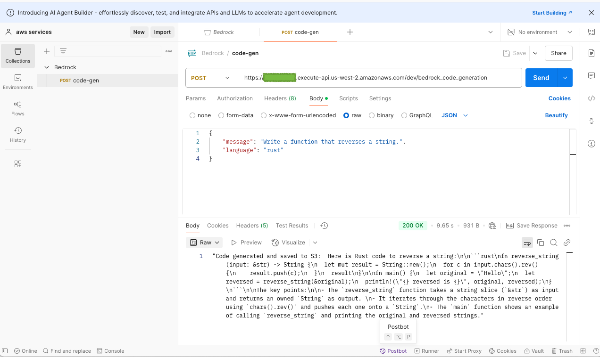
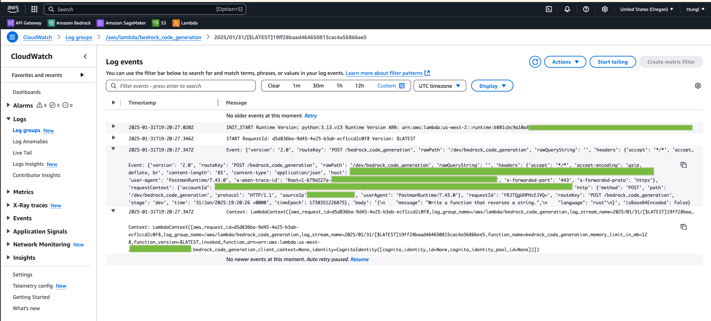

# aws-bedrock-code-generation

### Description:
- In this project, we will create a code generation app using AWS BedRock. 
 
### Architecture:
- Request/Query -> Lambda -> BedRock -> Store S3 -> Response.
- APIgateway to Lambda 

### Setup:
- Create a S3 bucket name, e.g., `bedrock-bucket-tungyt`
- Gain the model access in BedRock foundation model. [link](https://docs.aws.amazon.com/bedrock/latest/userguide/getting-started.html) 
- Create a lambda function, e.g., `bedrock_code_generation`.

- In configuration, edit the timeout to 3 mins.
- In configuration, click on Permissions, then click on Role name, it'll lead you to IAM, under permissions policies, add permissions `AdministratorAccess` and save. This will allow you to have the aws access.

## Code:
- `lambda_function.py`
- After coding, then `deploying` it and testing it using Postman.

## API Gateway
- Go to the API Gateway service, create API, e.g. `code-gen`. 

- Create a route detail with `POST` /`bedrock_code_generation`

- Add the stages, e.g., `dev` and/or `prod`, and disable the auto deploy.

- Deploy it.

## Testing
1. Using Postman. 

2. Check CloudWatch

## Output sample
- In `code-output/2025-01-31_19-16-34.py` and `code-output/2025-01-31_19-20-35.rs`.

## Credits:
- [Tyler AI](https://www.youtube.com/@TylerReedAI)

